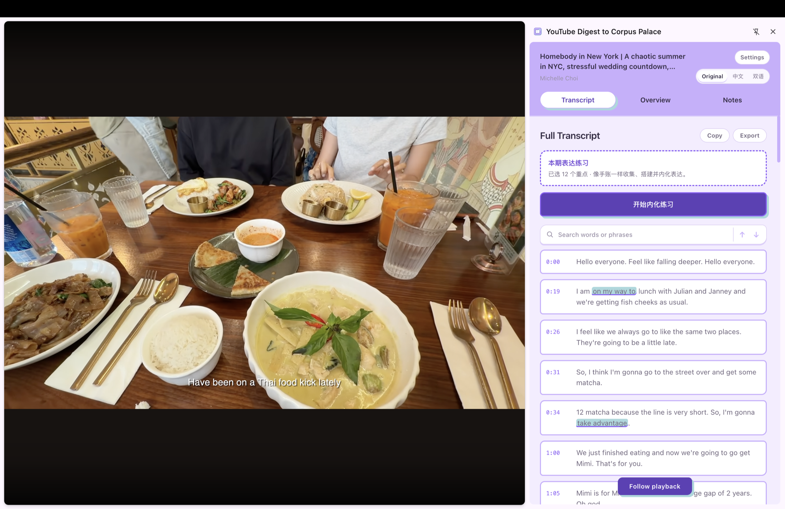
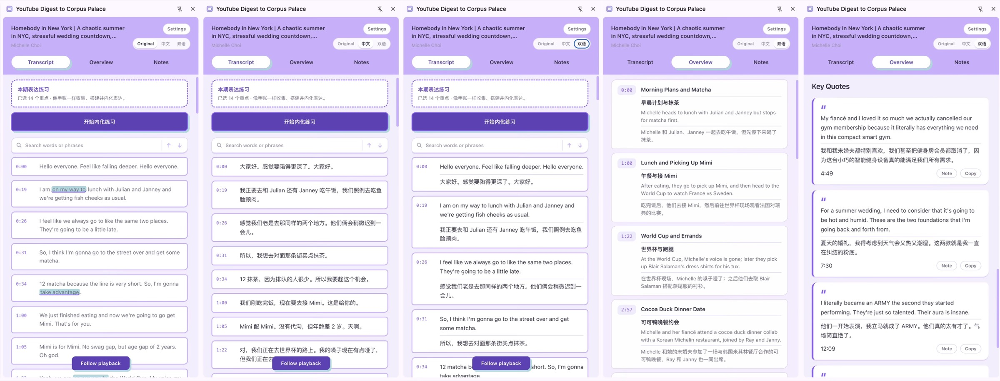
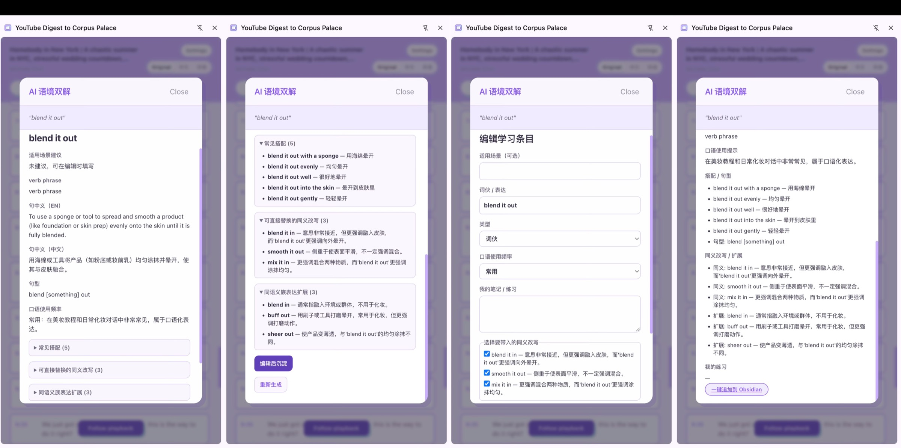
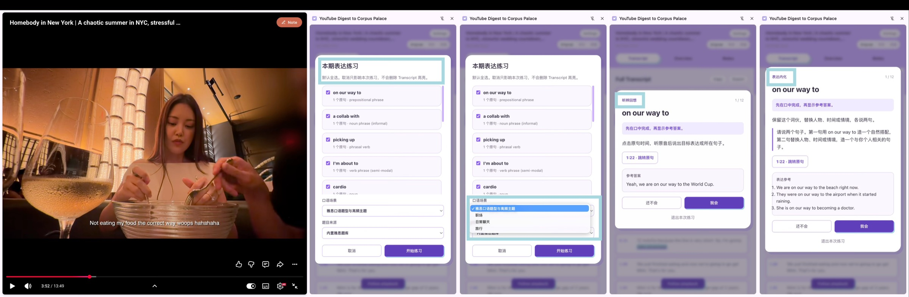
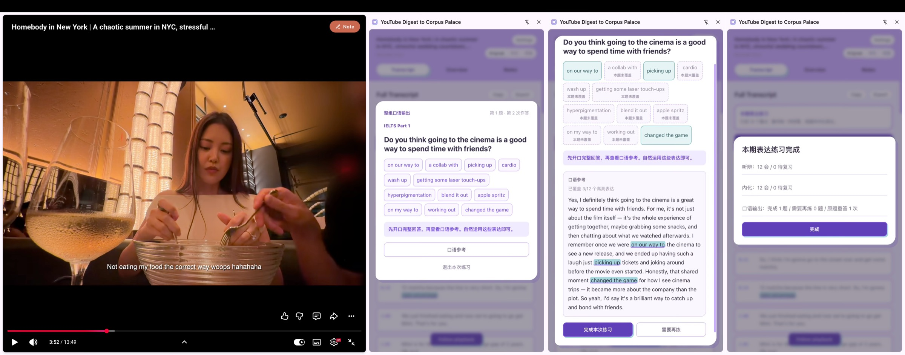
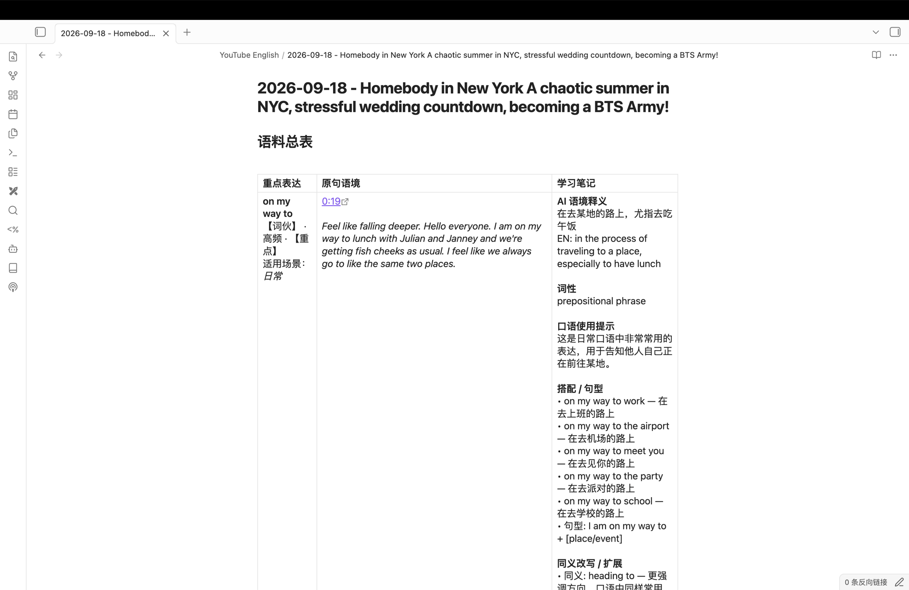
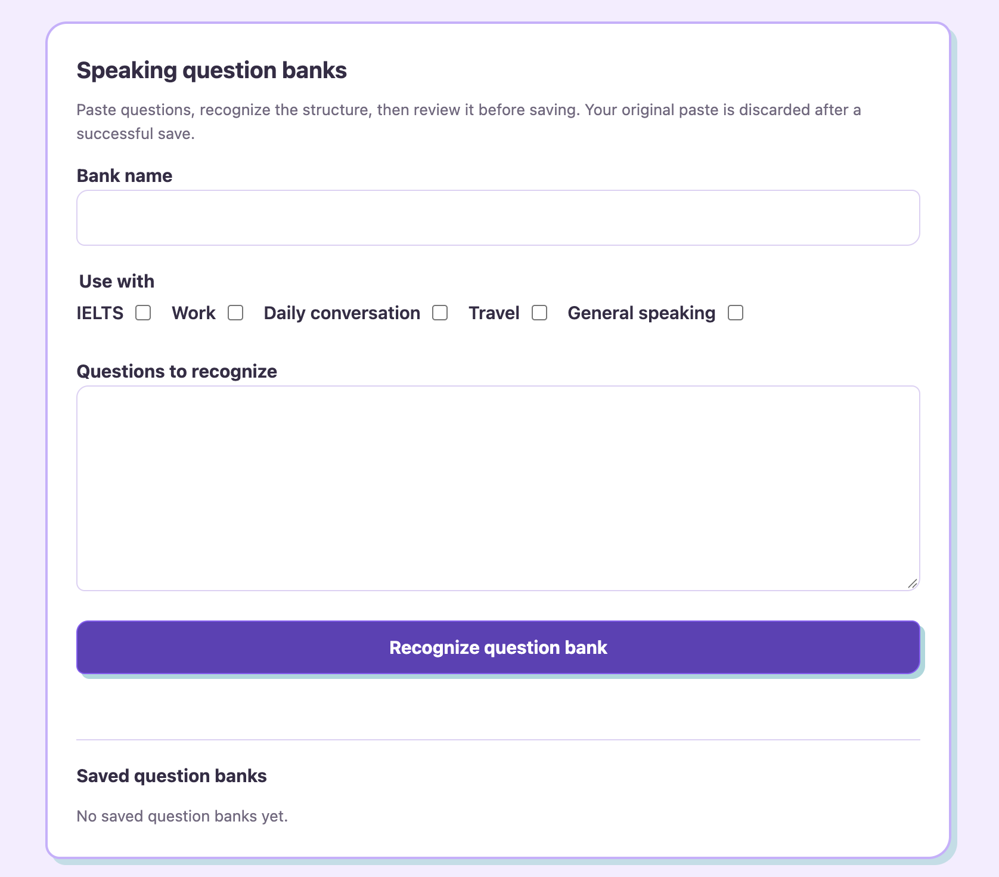

# YouTube Digest to Corpus Palace

[English](README.md) | [简体中文](README.zh-CN.md)

Turn every YouTube video into a resource for deep learning. Turn YouTube input into a personal English-speaking corpus with a Chrome side panel that keeps every expression inside its original video context, then guides you through contextual understanding, listening recall, expression internalization, speaking output, and long-term organization in Obsidian.



## From video input to speaking output

1. **Watch with context.** Read searchable original, Chinese, or aligned bilingual subtitles and jump to any moment from its timestamp.
2. **Highlight what you want to learn.** Select a word, chunk, or sentence frame directly in Transcript and generate an editable **AI contextual bilingual gloss**.
3. **Internalize before output.** Complete listening recall first, then practice substitutions and create two sentences for every selected expression.
4. **Speak with the whole set.** Choose IELTS, work, daily conversation, or travel. After every expression is marked as mastered, answer one question built for that speaking scenario. The reference answer attempts to use all highlighted expressions and reports verified coverage.
5. **Build your Corpus Palace.** Append expressions from the same video to one readable Obsidian table with timestamped context, learning notes, collocations, and paraphrases.

Your API keys and learning data stay in local Chrome storage. The extension has no analytics, telemetry, included API credits, or developer-operated server. It is installed locally from GitHub and is not currently available in the Chrome Web Store.

## Product tour

### Bilingual transcript and video navigation

Switch between original, Chinese, and bilingual subtitles, search the full transcript, follow playback, and jump from chapters or key quotes to the corresponding video moment.



### AI contextual bilingual gloss

DeepSeek explains the selected expression in its actual subtitle context: in-sentence English and Chinese meaning, part of speech, spoken frequency, collocations, sentence frames, paraphrases, and related expressions. Edit the learning entry before saving it; clicking a saved highlight reopens the cached gloss without another request.



### Listening recall and expression internalization

Choose any number of highlighted expressions from the current video. Recall the source sentence before revealing it, then internalize each word, chunk, or sentence frame through substitution and two original sentences. Speaking remains locked until every selected expression is marked as mastered.



### Speaking output for IELTS, work, daily conversation, and travel

Choose from four speaking scenarios: **IELTS, work, daily conversation, and travel**. Practice one whole-set question at a time after internalization is complete. IELTS mode draws from an approved local question bank when one is installed; the other scenarios can use your imported question bank or let DeepSeek generate a relevant question from the current expressions. Reference answers aim to incorporate every highlighted expression and show verified coverage.



### Obsidian corpus table

Entries from one video append to one Markdown note. The three-column table keeps the expression, timestamped source context, and structured learning notes readable together instead of scattering them across separate pages.



### Speaking question-bank management

Paste question-bank text, choose the profiles that may use it, let DeepSeek recognize the structure, review the preview, and save only the structured questions you approve.



## New in v2.4.3

- Replaced the refined logo with its transparent-background PNG source across Chrome, the side panel, and release packages.

## New in v2.4.2

- Updated every extension surface and package to the refined Corpus Palace logo supplied by the project owner.

## New in v2.4.1

- Chrome, the side-panel empty state, and release packages now use the supplied Corpus Palace PNG as their single shared logo source.

## New in v2.4.0

- A new Corpus Palace notebook logo carries the lavender-and-mint visual identity across Chrome and the extension's empty state.
- The side panel now uses a lavender journal workspace, bordered transcript cards, mint expression highlights, and deep-purple primary actions.
- Transcript practice now opens from a clearer two-part launcher: a dashed selection summary followed by a dedicated **Start internalization practice** button.
- Settings use the same hand-drawn card shapes, lavender structure, mint offset shadows, and amber reserved for warnings.

## New in v2.3.3

- The visible product name is now consistently **YouTube Digest to Corpus Palace** across Chrome, Settings, exports, and documentation.
- Practice-material validation now keeps valid expressions and retries only failed items with the exact validation reason.
- If a targeted repair still fails, the error identifies the expression and problem instead of reporting only an incomplete batch.

## New in v2.3.1

- Click a saved purple highlight in Transcript to reopen its contextual AI gloss without selecting the text again.
- Highlight clicks no longer seek the video; clicks elsewhere on the transcript row keep the existing seek behavior.
- Open focused highlights with Enter or Space.

## New in v2.3.0

- Reopen a contextual gloss for the same selected text at the same caption occurrence from local Chrome storage without another DeepSeek request.
- Use **重新生成** on the gloss card only when you intentionally want a fresh AI result. The same expression in another caption keeps its own contextual meaning.

## New in v2.2.1

- Fixed speaking-reference coverage badges showing `0/N` after verified coverage entered the learning session.

## New in v2.2.0

- Start **本期表达练习** from the top of Transcript and choose any saved highlights from the current video.
- Move through listening recall, contextual internalization, and one whole-set speaking round. Every selected expression must be mastered in internalization before speaking unlocks.
- Add your own speaking question bank by pasting text in Settings, recognizing it, reviewing the structured preview, and explicitly saving it.
- For IELTS, use an approved exact local bank when you have prepared one. Work, daily conversation, and travel can use your bank, DeepSeek, or the documented smart fallback.
- Retry the same speaking question without an API call, or request a different unused question when more practice is needed.
- IELTS reference answers now make a strong attempt to use every highlighted expression. If the first answer misses any, the extension requests one natural revision and then shows the verified coverage in the speaking card.

## New in v1.2.0

- Search transcript words or phrases and move through every match.
- Use one Original, Chinese, or bilingual setting across Transcript, Overview, and Notes. New videos stay in Original by default.
- Translate visible Overview and Notes content progressively in small cached batches.
- Explain selected transcript text or save it directly as a timestamped note.
- Keep your transcript position across navigation, with the panel closing automatically outside YouTube video pages.

## Corpus Palace learning flow

This personal remix adds a context-first English-speaking workflow without turning every selected sentence into a separate note.

1. Select English text in the YouTube player captions or the side-panel Transcript.
2. Request an **AI 语境释义**. DeepSeek uses the surrounding subtitle context to provide the in-sentence English and Chinese meaning, part of speech, collocations, a sentence frame, spoken-frequency label, paraphrases, and related expressions.
3. Edit the expression's optional usage contexts, expression type, spoken frequency, and your own practice note. Usage contexts belong to the expression rather than the video topic, and broad expressions can leave them blank. Paraphrases and related expressions are optional, so they are never silently added.
4. Use **Append to Obsidian** to open Obsidian on your device. Entries from the same video share one Markdown note and append as rows in one Corpus Palace table, keeping their timestamped context.

This is AI-generated learner guidance, not a quotation from a dictionary. It works best with captions and a configured DeepSeek API key.

### Set up Obsidian export

In **Settings**, fill in the exact name of the local Obsidian Vault and an optional folder (the default is `YouTube English`). The extension prepares an `obsidian://new` append request only after you click the export button. Obsidian, not the extension, performs the local file operation, so confirm the result in Obsidian after it opens.

## Local IELTS OCR workflow (macOS only)

This development tool uses macOS PDFKit, Vision, and AppKit. It is not part of the public extension package, and its PDF, OCR, review, and generated-bank files must stay local and Git-ignored.

1. Create the private OCR intermediate with `npm run ocr:ielts -- INPUT.pdf tmp/ielts-ocr-YYYY-MM_DD.json`.
2. Render and inspect every source page. Record page and OCR digests plus any source-specific replacements in an ignored `data/ielts-ocr-review-YYYY-MM_DD.json` review artifact. Do not edit the generated bank by hand.
3. Regenerate only from the reviewed inputs: `node scripts/parse-ielts-ocr.mjs INPUT.json data/ielts-question-bank.local.json REVIEW.json`. The parser requires all 46 reviewed OCR pages and an approved review artifact before it writes a local bank.

The normal Swift command requires a matched Xcode or Command Line Tools compiler and macOS SDK. This host currently has Swift 6.3.3 with default SDK interfaces built for 6.3.2, so the ordinary command fails until Command Line Tools or Xcode is repaired or updated. Use a normally matched macOS toolchain; do not treat temporary local compile workarounds as the project default.

## Speaking question banks and local IELTS data

In **Settings**, choose one or more speaking profiles, paste plain-text questions, then choose **Recognize question bank**. Recognition sends that paste to DeepSeek only for the request you start. Review the returned structured questions before saving. After a successful save, the original paste is discarded and only the structured question records are kept in Chrome local storage. A failed recognition or a preview you do not save leaves the paste in the Settings textarea so you can correct it.

Each recognition, a new AI-generated speaking question, and a new AI reference answer is a separate DeepSeek request and can incur additional provider charges. Repeating the same speaking question does not call DeepSeek. Check DeepSeek pricing and your account limits before repeated recognition or practice.

Question sources behave as follows:

- IELTS uses exact stored questions from an approved bundled local bank. In **Bundled plus mine**, eligible learner-bank questions can join that exact local source. If no approved local bank is installed, IELTS bundled questions are unavailable rather than replaced with the synthetic sample.
- Work, daily conversation, and travel can use **Smart mix**, **My bank only**, or **DeepSeek only**. Smart mix prefers an eligible unused learner question and uses DeepSeek only when it needs a new question.
- The public repository contains only a synthetic schema/test sample. It is not offered as IELTS content.

The supplied seasonal IELTS PDF may contain third-party material. Its OCR-derived bank stays in `data/ielts-question-bank.local.json`, which is Git-ignored and excluded from the public package. Only use `npm run package:local` after you have reviewed and approved a local bank and have permission to use its content. The command validates the bank, runs the test and public-release checks, creates `dist/youtube-digest-v2.4.3-local-with-question-bank.zip`, scans the archive inputs for common credentials, and prints a SHA-256 digest. `npm run package` always creates the public ZIP without that bank.

To install a local package, extract that ZIP into a permanent folder, choose that exact folder in Chrome's **Load unpacked** flow, and keep it in place. After rebuilding or replacing the extracted files, click **Reload** for YouTube Digest to Corpus Palace at `chrome://extensions` and refresh open YouTube tabs.

The extension has no runtime PDF import, PDF renderer, or OCR engine. The macOS OCR workflow above is one-time development tooling and is never included in either extension runtime.

## Install with your coding agent

You do not need to understand the code or use the command line. Send this message to your coding agent:

> Download or clone this project into a permanent folder I choose, tell me its exact full path, and use that same folder for Chrome's Load unpacked step. If I need a suggestion during this first installation, offer `~/Documents/youtube-digest` on macOS or Linux, or `%USERPROFILE%\Documents\youtube-digest` on Windows, but do not assume either path. Walk me through installation and setup in simple terms. https://github.com/sellafeng123/youtube-digest-to-corpus-palace

Your agent should:

1. Ask where you want to keep the project, download or clone it there, and tell you the exact full path. If you want a suggestion, it can offer `~/Documents/youtube-digest` on macOS or Linux, or `%USERPROFILE%\Documents\youtube-digest` on Windows.
2. Open the official Supadata and DeepSeek pages below and help you create your own accounts.
3. Walk you through selecting the exact project folder you chose in Chrome with **Load unpacked**.
4. Show you where to enter your API keys in the extension's **Settings** page.
5. Open a YouTube video with captions and confirm the transcript and translation work.

Keep this folder in the same place after installation. If you move or delete it, Chrome's unpacked extension stops working until you load the extension again from its new permanent folder.

Never paste an API key into an AI chat, source file, screenshot, or public message. Enter keys yourself, directly in the YouTube Digest to Corpus Palace Settings page. Your coding agent can point to the correct field without seeing the key.

## Install manually

If you prefer to do it yourself:

1. Open [github.com/sellafeng123/youtube-digest-to-corpus-palace](https://github.com/sellafeng123/youtube-digest-to-corpus-palace).
2. Choose **Code**, then **Download ZIP**.
3. Choose a permanent folder and unzip the project there. Optional suggestions are `~/Documents/youtube-digest` on macOS or Linux, or `%USERPROFILE%\Documents\youtube-digest` on Windows. You may use a different folder.
4. In Chrome, open `chrome://extensions`.
5. Turn on **Developer mode**.
6. Click **Load unpacked**.
7. Select the exact project folder you chose, which must contain `manifest.json`.
8. Pin YouTube Digest to Corpus Palace from Chrome's Extensions menu if you want quick access.

Because this is an unpacked extension, it does not update automatically. After downloading an update or changing local files, click **Reload** on the YouTube Digest to Corpus Palace card at `chrome://extensions`, then refresh open YouTube tabs. Moving or deleting the source folder breaks the unpacked extension until you load it again from the new location.

## Set up your API keys

YouTube Digest to Corpus Palace needs two keys under your own provider accounts:

1. A **Supadata API key** to retrieve YouTube transcripts.
2. A **DeepSeek API key** for overviews, explanations, translation, and automatic note polishing.

### Get a Supadata API key

1. Open the official [Supadata sign-up page](https://dash.supadata.ai/auth/sign-up).
2. Create an account and complete the short onboarding flow.
3. Supadata generates an API key automatically during onboarding.
4. Open the [Supadata dashboard](https://dash.supadata.ai/) whenever you need to find or manage the key.
5. Copy the key and paste it into **Supadata API key** in YouTube Digest to Corpus Palace Settings.

See the [official Supadata documentation](https://docs.supadata.ai/) if the dashboard flow changes.

### Get a DeepSeek API key

1. Open the official [DeepSeek API Keys page](https://platform.deepseek.com/api_keys).
2. Sign in or create a DeepSeek Platform account when prompted.
3. Choose **Create new API key**, give it a recognizable name such as `YouTube Digest to Corpus Palace`, and create it.
4. Copy the key immediately. The full key may only be shown once.
5. Paste it into **DeepSeek API key** in YouTube Digest to Corpus Palace Settings.
6. If DeepSeek reports insufficient balance, add credit in your DeepSeek Platform account and try again.

See the [official DeepSeek API documentation](https://api-docs.deepseek.com/) for current account and API details.

Open **Settings** from the side panel. You can also open the YouTube Digest to Corpus Palace **Options** page from its card at `chrome://extensions` or by right-clicking its toolbar icon. Paste keys only into these Settings fields. Never paste a key into an AI chat, repository file, screenshot, or public message.

The published version supports DeepSeek V4 Flash as its only AI provider:

```text
Base URL: https://api.deepseek.com
Model: deepseek-v4-flash
```

YouTube Digest to Corpus Palace sends every DeepSeek request in non-thinking mode for responsive, predictable interactions. The endpoint and model are fixed in Settings, so the only AI credential you enter is your DeepSeek API key. To use another provider or model, copy the safe customization prompt in Settings and give it to a coding agent for your local copy. Never add an API key to that prompt or chat.

Keys and settings are stored in Chrome's local extension storage on your device. Release builds do not include or use `config.js`.

## Use YouTube Digest to Corpus Palace

1. Open a standard YouTube watch page with captions.
2. Click the YouTube Digest to Corpus Palace extension icon to open the side panel.
3. Read the timestamped transcript, or choose **Original**, **中文**, or **双语**.
4. Open **Overview** when you want AI-generated chapters and key quotes.
5. Select transcript text when you want an AI explanation.
6. Save a note from the player or a key quote, then revisit it from **Notes**.

## What works today

- Google Chrome 116 or newer, using the Side Panel API.
- Standard `youtube.com/watch` video pages.
- Native subtitle tracks returned by Supadata. YouTube Digest to Corpus Palace prefers English when available, but may show another native language.
- Original, Simplified Chinese, and aligned bilingual transcript views.
- AI overviews, selected-text explanations, translation, and automatic note polishing.
- Local notes and a local cache for recent transcript and digest results.
- DeepSeek V4 Flash for all published AI features. Other providers require a local code adaptation and are not supported by this published version.

Shorts, live streams, private or access-restricted videos, and videos without an available native transcript may not work. Firefox, Safari, mobile browsers, and other Chromium browsers are not currently tested or supported.

YouTube Digest to Corpus Palace forces Supadata's `mode=native`. It does not request AI-generated transcripts or perform local audio transcription when native captions are unavailable.

## Supadata free tier and request costs

Current as of August 9, 2026, the [Supadata pricing page](https://supadata.ai/pricing) lists a free tier with **100 credits per month**, no credit card required. Unused credits do not roll over. Supadata pricing can change, so check the current page before relying on these numbers.

The [Supadata transcript documentation](https://docs.supadata.ai/get-transcript) describes the transcript request modes and credit behavior:

- A native transcript request uses **1 credit**, regardless of video duration.
- A generated transcript costs **2 credits per video minute**. YouTube Digest to Corpus Palace does not use this path because it forces `mode=native`.
- An unavailable native lookup returned as HTTP `206` still uses **1 credit**.

With the current native-only behavior, the free tier can cover roughly 100 transcript lookups per month when each request succeeds once. Retries and unavailable-caption lookups also consume credits, so actual successful-video coverage can be lower.

DeepSeek usage is separate from Supadata. YouTube Digest to Corpus Palace does not collect payments or resell access. Set spending limits and monitor both accounts.

## DeepSeek V4 Flash pricing

As of August 27, 2026, DeepSeek lists these USD prices per 1 million tokens on its official [pricing page](https://api-docs.deepseek.com/quick_start/pricing/):

| Token type | Off-peak | Peak |
| --- | ---: | ---: |
| Cache-hit input | $0.007 | $0.014 |
| Cache-miss input | $0.22 | $0.44 |
| Output | $0.66 | $1.32 |

Peak hours are 01:00–04:00 and 06:00–10:00 UTC, Monday through Friday. All other hours use off-peak rates.

A measured 20-minute English talk used about **32,600 input tokens** and an estimated **3,500 to 4,500 output tokens** across 43 small translation batches. At current prices, translating the full video costs approximately:

- **Off-peak: $0.003 to $0.010 USD**.
- **Peak: $0.005 to $0.020 USD**.

The lower end assumes most repeated input hits DeepSeek's cache. The upper end assumes cache misses. Translation is lazy and cached, so translating only part of a video costs less. Check the official page before relying on these prices.

## Remix it with your coding agent

This is a personal remix project. Upstream issues and pull requests are not accepted. If something breaks or you want a new feature, download or fork your own copy and ask your coding agent to fix, remix, or personalize it for you.

YouTube Digest to Corpus Palace uses plain HTML, CSS, and JavaScript with no build step, so it is a friendly starting point for agent-assisted projects. Ideas to try:

- Add more translation languages and let each person choose a learning language.
- Create customized summary templates for lectures, interviews, tutorials, reviews, or research talks.
- Build a vocabulary notebook that saves a word, its sentence, meaning, and video timestamp.
- Export notes and vocabulary to Markdown, CSV, Anki, or another study tool.
- Add personal topic filters that highlight the chapters most relevant to a goal.
- Add optional local-model support for a different privacy and cost tradeoff.
- Improve accessibility with keyboard navigation, font controls, and higher-contrast themes.

Ask your agent to preserve the bring-your-own-key model, keep secrets out of source files, run the checks below, and test the remix on real videos.

If you want another AI provider or model, first open the exact YouTube Digest to Corpus Palace project folder that Chrome loaded through **Load unpacked** in your coding agent. Then open YouTube Digest to Corpus Palace Settings and use **Copy customization prompt**. Replace the `[PROVIDER]` and `[MODEL]` placeholders before sending it. Do not include any API key in the prompt or chat. After the agent updates your local copy, enter the key yourself in the Settings field it identifies.

## Privacy and data flow

YouTube Digest to Corpus Palace makes provider requests directly from the extension:

1. It sends a canonical YouTube watch URL to Supadata to request the native transcript.
2. It sends the transcript and relevant video metadata to DeepSeek when you request AI features.
3. Focused features send only the content they need, such as selected text with context or small transcript batches for translation.
4. It stores keys, settings, notes, and recent cache entries locally in Chrome.

There is no YouTube Digest to Corpus Palace account system, advertising, analytics, or telemetry. Supadata and DeepSeek still receive data under their own terms and privacy policies. See [PRIVACY.md](PRIVACY.md) for details.

## Troubleshooting

### The Digest button is missing on a YouTube video

- At `chrome://extensions`, find YouTube Digest to Corpus Palace and click **Reload**, then refresh the YouTube tab.
- Confirm that you are on a standard `https://www.youtube.com/watch?...` page, not a Short, embed, or live page.
- The current version automatically follows YouTube when its responsive action bar changes. Wait a moment after the page finishes loading.
- If you have an older downloaded copy, resizing the YouTube window horizontally once may reveal the button. Then download the latest version so resizing is no longer required.
- If it is still missing, ask your coding agent to inspect the content script on that exact video page.

### The side panel does not open

- Confirm that you are on a standard `https://www.youtube.com/watch?...` page.
- At `chrome://extensions`, confirm YouTube Digest to Corpus Palace is enabled and click **Reload**.
- Refresh the YouTube tab after reloading the extension.
- Ask your coding agent to inspect the extension if the problem continues.

### YouTube Digest to Corpus Palace asks for setup

- Open **Settings** and save both a Supadata key and a DeepSeek key.
- This published version uses the fixed DeepSeek V4 Flash endpoint and model. There are no Base URL or Model fields to configure.
- If Settings says a legacy custom provider was removed, enter a DeepSeek key. The old AI key was cleared so it could not be reused with the wrong service.

### No transcript is found

- Confirm the video is public and has native captions.
- Check your Supadata key, remaining credits, rate limit, and account status.
- Remember that unavailable native lookups and manual retries may still consume credits.

YouTube Digest to Corpus Palace will not fall back to generated transcription.

### AI requests fail

- A `401` or `403` usually means the DeepSeek key or account access is invalid.
- A `429` usually means a DeepSeek rate or spending limit was reached.
- Confirm the key was created in the DeepSeek Platform account linked above and that the account has available credit.
- If you adapted a local copy for another model, use the Settings customization prompt again and ask your coding agent to inspect that local implementation.

Never share API keys, private transcripts, or personal notes in chats, screenshots, or logs.

## Checks for coding agents

Ask your coding agent to run these commands after changing the project:

```bash
npm test
npm run check
npm run package
```

The agent should also reload the unpacked extension in Chrome and test several real YouTube videos. Automated checks do not prove that live provider requests and YouTube interactions work.

## Project origin and attribution

YouTube Digest to Corpus Palace is a personal fork and extended remix of [YouTube Digest](https://github.com/zarazhangrui/youtube-digest) by Zara Zhang.

The original project is licensed under the MIT License. Its copyright and license notice are retained in [LICENSE](LICENSE). This fork adds the Corpus Palace contextual-learning workflow, expression internalization, multi-scenario speaking practice, question-bank management, and Obsidian export.

## License

MIT. See [LICENSE](LICENSE).
